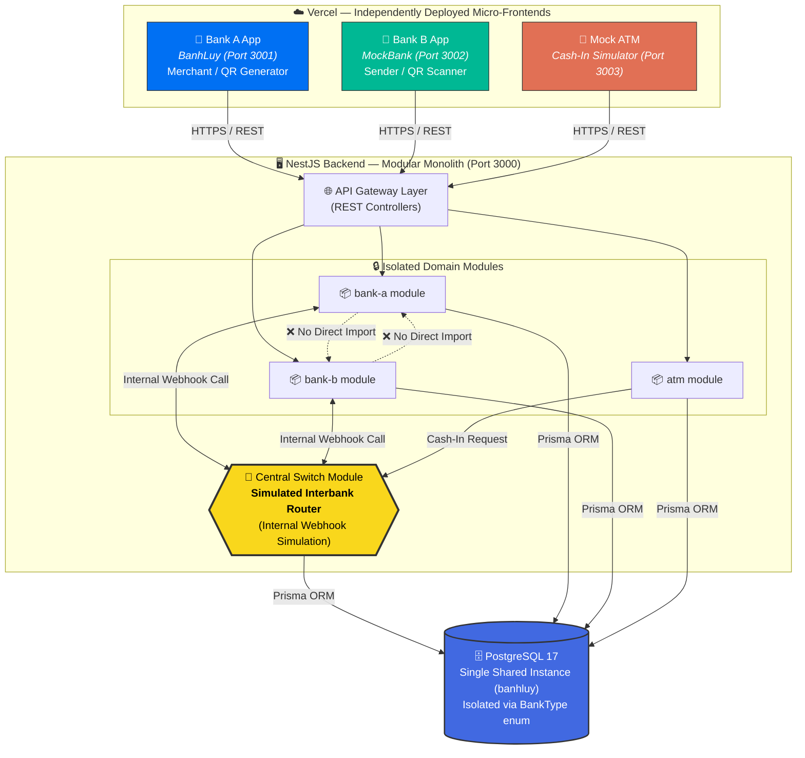
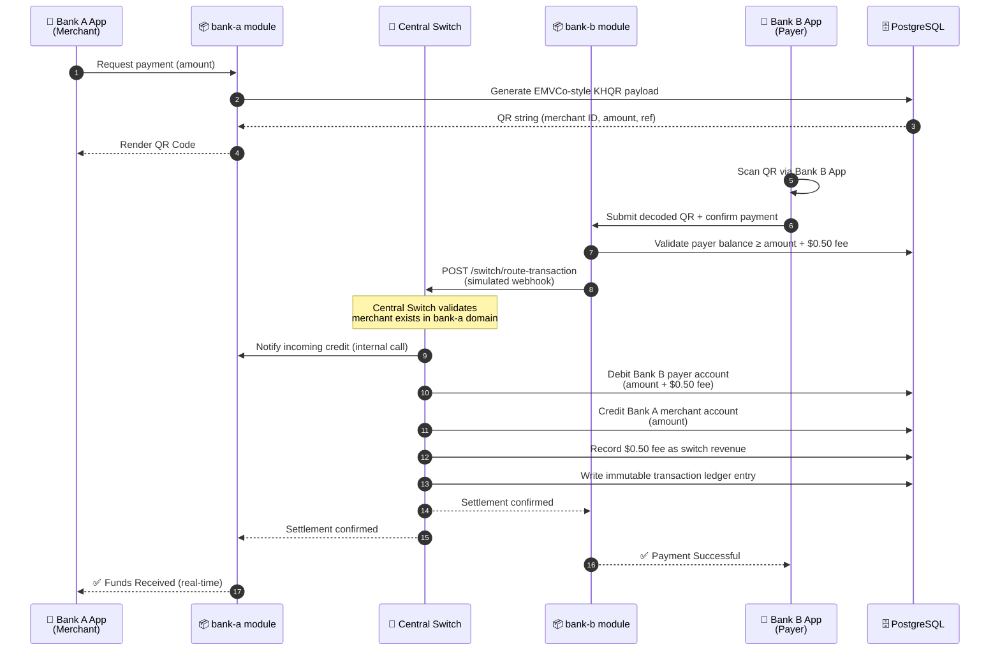
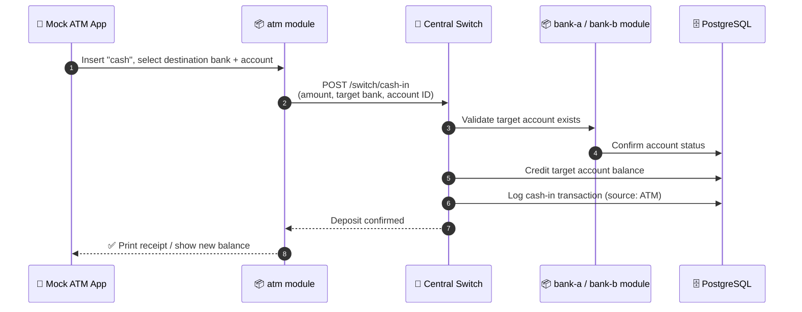

# 🏦 Dual-Bank Interoperability Ecosystem

### *A Simulated National Payment Gateway (KHQR / Bakong-Inspired) Demonstrating Real-Time Cross-Bank Settlement*

[](#)
[](#)
[](#)
[](#)
[](#)

---

## 1. 📖 Executive Summary

Cross-bank digital payments are deceptively hard. When a customer of **Bank A** pays a customer of **Bank B**, the transaction can't simply update one ledger — it has to traverse a **trusted intermediary switch**, atomically debit one institution, credit another, apply interoperability fees, and guarantee consistency even under failure.

This project is a full-stack simulation of that exact problem, modeled after real-world national payment rails like **Cambodia's Bakong / KHQR system**. It reproduces the core mechanics of interbank interoperability — **EMVCo-style QR code generation, cross-institution routing, and real-time settlement** — inside a portfolio-scale, self-hosted ecosystem.

Rather than building "yet another CRUD banking app," this project intentionally models the **hardest part of fintech engineering**: how two independent, mutually-distrusting systems agree on money movement through a neutral switch — without ever talking to each other directly.

**What makes this project stand out:**

- 🏗️ **Enterprise-grade architecture** — Micro-frontends + a strictly modular backend, not a monolithic tangle.
- 🔐 **True module isolation** — `bank-a`, `bank-b`, and `atm` modules cannot import each other. All cross-domain communication is forced through a `central-switch`, exactly like real interbank middleware (e.g., ISO 8583 / ISO 20022 switches).
- 💱 **Realistic settlement logic** — Cross-bank transactions apply a **$0.50 interoperability fee**, mirroring real switch-operator revenue models.
- 🧩 **Independently deployable frontends** — Each bank is a separate Next.js app, deployed and versioned independently, just as competing banks would never share a frontend codebase.

---

## 2. 🗺️ System Architecture

The ecosystem consists of **three independently deployed client applications** communicating with a **single modular-monolith backend**, which internally enforces bank-to-bank isolation via a central switch layer.



**Key architectural decision:** `bank-a` and `bank-b` are physically prevented (via linting rules and folder boundaries) from importing one another's services. This is not an accident — it **simulates the real-world reality that competing banks run on completely separate systems** and can only interoperate through a neutral, trusted switch. The `central-switch` module is the *only* component permitted to talk to both.

---

## 3. ⚡ Core Workflows — The Magic

### 💸 3.1 Cross-Bank KHQR Payment Flow

This is the centerpiece workflow: a customer at **Bank B** pays a merchant at **Bank A** using a scanned QR code, with funds settling across two independent ledgers in real time.



**Why this matters:** Bank B's module never directly touches Bank A's balance — it only ever talks to the switch. The switch is the single source of truth for atomicity, ensuring the debit and credit either **both succeed or both roll back**, just like real ISO 20022 interbank clearing.

---

### 🏧 3.2 Mock ATM (Cash-In) Flow

Simulates a customer depositing physical cash into their digital bank account via an ATM terminal.



The ATM module has **no direct knowledge** of Bank A or Bank B's internal logic — it simply hands off to the switch, which resolves *which* bank owns the destination account and routes accordingly.

---

## 4. 🛠️ Tech Stack & Design Patterns

| Layer | Technology | Purpose |
|---|---|---|
| **Frontend** | Next.js 16 (App Router) | 3 independently deployed micro-frontends |
| **Backend** | NestJS | Modular monolith with enforced domain boundaries |
| **ORM** | Prisma 6 | Type-safe database access & migrations |
| **Database** | PostgreSQL 17 | Single shared instance, logically isolated |
| **State** | Zustand + Persist | Token & session storage per app |
| **QR Standard** | EMVCo-inspired payload | Merchant-presented QR simulation (KHQR-style) |

### 🧠 Architectural Patterns

- **🧩 Micro-Frontends** — Each bank owns a fully independent Next.js application with its own deployment pipeline, environment variables, and release cadence. This mirrors reality: Bank A and Bank B would never ship frontend code from a shared repository.

- **🏛️ Modular Monolith** — The backend is a *single deployable NestJS application*, but internally structured with **hard module boundaries**. `bank-a`, `bank-b`, and `atm` are self-contained domains that cannot import each other's providers or services — enforced through NestJS module encapsulation and project structure. This gives the operational simplicity of a monolith with the domain isolation discipline of microservices, **without the distributed-systems tax** (network latency, service discovery, distributed transactions) that true microservices would require for a project of this scope.

- **🔀 Switch / Mediator Pattern** — The `central-switch` module acts as a **mediator**, decoupling `bank-a` and `bank-b` completely. Neither module has a compile-time or runtime dependency on the other — all interbank communication is routed through simulated internal webhook calls, closely mirroring how real payment switches (like Bakong, Visa, or SWIFT) broker trust between otherwise-unconnected financial institutions.

---

## 5. 🗄️ Database Architecture

Although Bank A, Bank B, and the ATM all persist to **one shared PostgreSQL instance**, their data is **logically and securely isolated** using a `BankType` enum discriminator on core tables:

```prisma
enum BankType {
  BANK_A
  BANK_B
}

model Account {
  id        String   @id @default(uuid())
  bankType  BankType
  ownerName String
  balance   Decimal  @default(0)
  createdAt DateTime @default(now())

  @@index([bankType])
}

model Transaction {
  id            String   @id @default(uuid())
  fromAccountId String
  toAccountId   String
  fromBank      BankType
  toBank        BankType
  amount        Decimal
  fee           Decimal  @default(0)
  status        TransactionStatus
  createdAt     DateTime @default(now())
}
```

**Isolation is enforced at the service layer, not just the schema:** every query within `bank-a` and `bank-b` modules is scoped by `bankType`, so a bug in Bank B's service can never accidentally read or mutate Bank A's accounts. Only the `central-switch` module is permitted to write cross-bank transactions that touch both `BankType` values in a single operation — and it does so inside a **Prisma `$transaction()`** block to guarantee atomicity (both legs commit, or neither does).

---

## 6. 🧪 Seeded Test Accounts (Ready for Testing)

When the backend database is seeded (`npx prisma db seed`), four test accounts are created automatically:

| Account Name | Bank | Phone Number | Security PIN | Account Number | Starting Balance |
| :--- | :---: | :---: | :---: | :---: | :---: |
| **Bank A User One** | `BANK_A` | `+85511111111` | `1234` | `BA-00000001` | `$1,000.00` |
| **Bank A User Two** | `BANK_A` | `+85511111112` | `5678` | `BA-00000002` | `$500.00` |
| **Bank B User One** | `BANK_B` | `+85522222221` | `1234` | `BB-00000001` | `$800.00` |
| **Bank B User Two** | `BANK_B` | `+85522222222` | `5678` | `BB-00000002` | `$250.00` |

---

## 7. 🚀 Local Setup & Running

### Prerequisites
- Node.js ≥ 20
- npm or pnpm
- PostgreSQL 17 running locally or via Docker

### 1️⃣ Clone & Install

```bash
git clone https://github.com/<your-username>/dual-bank-interoperability-ecosystem.git
cd dual-bank-interoperability-ecosystem
```

### 2️⃣ Backend Setup (NestJS + Prisma)

```bash
cd backend
cp .env.example .env        # configure DATABASE_URL
npm install
npx prisma migrate dev      # run migrations
npx prisma db seed          # seed test accounts
npm run start:dev           # runs API on http://localhost:3000/api
```

### 3️⃣ Frontend Setup (run each in a separate terminal)

```bash
# Terminal 2 — Bank A App (Sapphire Blue Theme)
cd frontend/bank-a-app
npm install
npm run dev                 # http://localhost:3001

# Terminal 3 — Bank B App (Amethyst Purple Theme)
cd frontend/bank-b-app
npm install
npm run dev                 # http://localhost:3002

# Terminal 4 — Mock ATM Kiosk (Emerald Terminal Theme)
cd frontend/atm-app
npm install
npm run dev                 # http://localhost:3003
```

### 4️⃣ Try the Cross-Bank Flow

1. **ATM Cash Deposit:** Open **Mock ATM (`localhost:3003`)** → click `BA-00000001` → deposit `$500` → view printed paper receipt.
2. **QR Receive:** Open **Bank B App (`localhost:3002`)** → sign in as `Bank B User One` (`+85522222221` / PIN `1234`) → generate a `$25.50` KHQR code → click `Copy Payload`.
3. **Cross-Bank Scan & Pay:** Open **Bank A App (`localhost:3001`)** → sign in as `Bank A User One` (`+85511111111` / PIN `1234`) → paste payload into **Scan & Pay** → confirm payee & PIN `1234` → watch real-time settlement with `$0.50` clearing fee!

---

## 📌 Project Status

This is an actively developed portfolio project demonstrating enterprise-grade architectural thinking applied to a fintech interoperability problem. Contributions, forks, and architecture discussions are welcome.

---

<p align="center">Built to demonstrate systems thinking, not just CRUD.</p>
