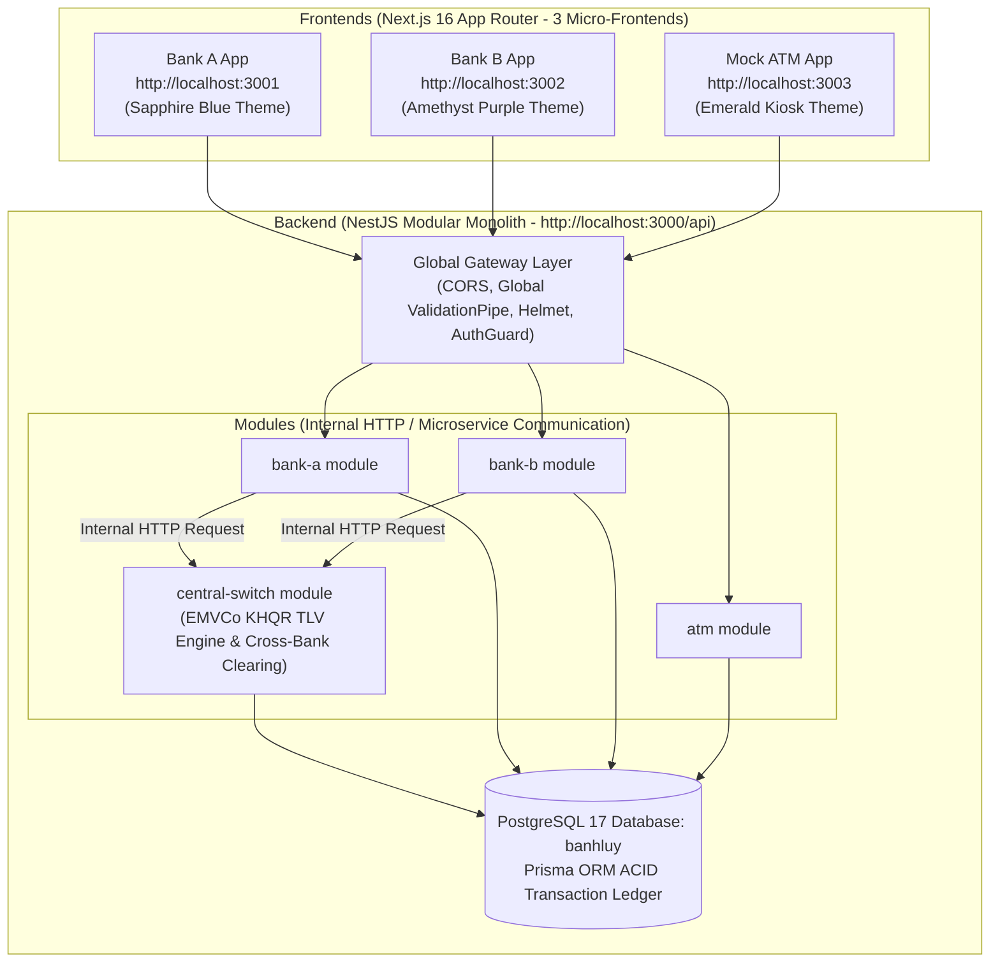

# 🏦 BanhLuy — Dual-Bank Interoperability Ecosystem (KHQR / Central Switch Simulation)

[](https://nestjs.com/)
[](https://www.postgresql.org/)
[](https://www.prisma.io/)
[](https://nextjs.org/)
[](https://github.com/pmndrs/zustand)

**BanhLuy** is a portfolio-grade FinTech simulation project that models a **Centralized Clearing House** (similar to Bakong / KHQR in Cambodia) enabling real-time, interoperable digital payments and cash deposits across two independent digital banking applications (`Bank A` and `Bank B`) and an interactive **ATM Cash Deposit Kiosk**.

---

## 🏛 System Architecture

The project implements a **Modular Monolith Backend** paired with **three independent Next.js (App Router) Micro-Frontends**:



---

## ✨ Key Features & Capabilities

- **Strict Modular Monolith Backend:** Built with NestJS where modules (`bank-a`, `bank-b`, `atm`, `central-switch`) communicate via internal HTTP requests (`InternalHttpService`) with header-based secret authentication, simulating real microservices.
- **ACID-Compliant PostgreSQL Ledger:** All financial transfers, ATM deposits, and cross-bank payments execute within atomic `prisma.$transaction()` blocks to guarantee zero loss or duplication of funds.
- **EMVCo TLV KHQR Interoperability:** Generates and decodes Tag-Length-Value (TLV) QR codes compliant with EMVCo QR specifications, including merchant metadata, CRC-16 checksums, and expiration validation.
- **Automated Clearing House Fee:** Cross-bank payments (`BANK_A` ↔ `BANK_B`) automatically deduct a `$0.50` switch fee from the sender while crediting the full principal to the receiver.
- **Three Distinct Premium Micro-Frontends:**
  - **Bank A App (`port 3001`):** Royal Sapphire Blue banking dashboard with intra-bank transfers and KHQR receive/pay.
  - **Bank B App (`port 3002`):** Cyber Amethyst Purple banking dashboard with intra-bank transfers and KHQR receive/pay.
  - **Mock ATM App (`port 3003`):** Dark Emerald Terminal Kiosk allowing ACID cash deposits into any Bank A or Bank B account with animated live paper receipts.

---

## 🧪 Seeded Test Accounts (Ready for Testing)

When the backend database is seeded (`npx prisma db seed`), four test accounts are created automatically. You can use these credentials to log into the Bank A or Bank B frontends or deposit cash via the ATM kiosk:

| Account Name | Bank | Phone Number | Security PIN | Account Number | Starting Balance |
| :--- | :---: | :---: | :---: | :---: | :---: |
| **Bank A User One** | `BANK_A` | `+85511111111` | `1234` | `BA-00000001` | `$1,000.00` |
| **Bank A User Two** | `BANK_A` | `+85511111112` | `5678` | `BA-00000002` | `$500.00` |
| **Bank B User One** | `BANK_B` | `+85522222221` | `1234` | `BB-00000001` | `$800.00` |
| **Bank B User Two** | `BANK_B` | `+85522222222` | `5678` | `BB-00000002` | `$250.00` |

---

## 🚀 Quick Start & Installation

### Prerequisites
- **Node.js** `v20+`
- **PostgreSQL 17** (or via Docker Compose)

### 1. Configure & Start Backend Monolith (Port `3000`)
```bash
# Navigate to backend directory
cd backend

# Install dependencies
npm install

# Apply migrations & seed database
npx prisma migrate dev
npx prisma db seed

# Start NestJS development server
npm run start:dev
```
*API is now available at `http://localhost:3000/api`*

### 2. Launch Bank A Micro-Frontend (Port `3001`)
```bash
# Open a new terminal in frontend/bank-a-app
cd frontend/bank-a-app
npm install
npm run dev
```
*Access Bank A at `http://localhost:3001`*

### 3. Launch Bank B Micro-Frontend (Port `3002`)
```bash
# Open a new terminal in frontend/bank-b-app
cd frontend/bank-b-app
npm install
npm run dev
```
*Access Bank B at `http://localhost:3002`*

### 4. Launch ATM Kiosk Micro-Frontend (Port `3003`)
```bash
# Open a new terminal in frontend/atm-app
cd frontend/atm-app
npm install
npm run dev
```
*Access Mock ATM at `http://localhost:3003`*

---

## 🔄 End-to-End Interoperability Test Walkthrough

1. **Cash Deposit via ATM Kiosk (`http://localhost:3003`)**
   - Click **Bank A User One** (`BA-00000001`).
   - Select `$500` and click **Deposit Funds Now**.
   - Watch the animated paper receipt print out showing the updated balance.

2. **Generate KHQR in Bank B (`http://localhost:3002`)**
   - Sign in as **Bank B User One** (`+85522222221` / PIN `1234`).
   - Go to **Generate KHQR (Receive)**, enter `$25.50`, and click **Generate KHQR**.
   - Click **Copy Payload** to copy the EMVCo TLV string.

3. **Scan & Pay Across Banks from Bank A (`http://localhost:3001`)**
   - Sign in as **Bank A User One** (`+85511111111` / PIN `1234`).
   - Go to **Scan & Pay (Cross-Bank)**, paste the copied EMVCo TLV string, and click **Verify & Decode KHQR Payload**.
   - Confirm payee is `Bank B User One`, enter PIN `1234`, and click **Confirm & Pay Across Bank**.
   - Check **Overview & Transactions** to see `$25.50` transferred + `$0.50` Central Switch clearing fee!

---

## 📁 Repository Structure

```
BanhLuy/
├── backend/                  # NestJS Modular Monolith API
│   ├── prisma/               # PostgreSQL schema, migrations, & seeders
│   └── src/
│       ├── auth/             # JWT Authentication & PIN Bcrypt hashing
│       ├── atm/              # ATM unauthenticated deposit kiosk module
│       ├── bank-a/           # Bank A account & intra-bank transfer module
│       ├── bank-b/           # Bank B account & intra-bank transfer module
│       └── central-switch/   # EMVCo TLV KHQR & cross-bank clearing house
├── frontend/
│   ├── bank-a-app/           # Next.js 16 App Router — Bank A Sapphire Frontend
│   ├── bank-b-app/           # Next.js 16 App Router — Bank B Amethyst Frontend
│   └── atm-app/              # Next.js 16 App Router — ATM Terminal Kiosk Frontend
├── .gitignore                # Global git ignore configuration
├── docker-compose.yml        # PostgreSQL container setup
└── README.md                 # Full project documentation
```

---

## 📄 License
This project is for educational and portfolio demonstration purposes. All rights reserved © 2026.
